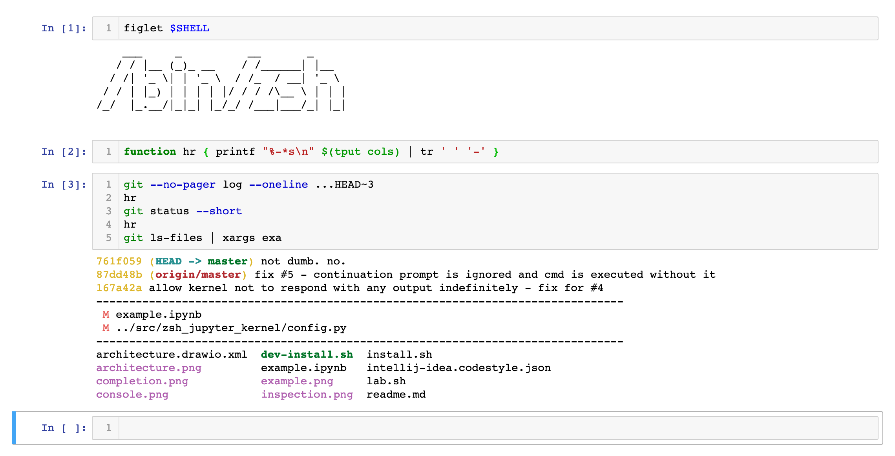

# zsh kernel for jupyter



a simple z shell jupyter kernel powered by python 3, pexpect and enthusiasm.

i love experimentation and tinkering, but usual shell terminals do not allow developing multiple different code snippets at once conveniently.
with shell kernels you can turn your scripts into notebooks!

if you find this product useful, please consider supporting me with a one-time tip.

## installation

1. install the python package from [pypi](https://pypi.org/project/zsh-jupyter-kernel/).
2. install the jupyter kernel spec using python script `install` in the `zsh_jupyter_kernel` module.
   check `python -m zsh_jupyter_kernel.install -h` for possible installation options.
   default installation will install the kernel in the user location.
   use `--sys-prefix` option if you want to install the kernel in your current virtual environment.

see some common installation examples below.

### pipenv

```sh
pipenv --python 3.10 install notebook zsh_jupyter_kernel
pipenv run python -m zsh_jupyter_kernel.install --sys-prefix
```

### pip

```sh
python -m pip install notebook zsh_jupyter_kernel
python -m zsh_jupyter_kernel.install --sys-prefix
```

## technical overview

the kernel launches zsh as if it was a regular process launched from your terminal with a few minor settings to make sure it works with jupyter. there is slight chance it wont work with super complicated zshrc setups, but it works with majority of configs including oh-my-zsh.

### how does code execution work

the kernel configures zsh prompt string to its own custom value.
when a user requests a cell execution, the code is sent to the kernel.
then the kernel puts the frontend on hold, sends the code to zsh process, and waits for the prompt string to release the frontend and let the user request more code execution.

### code completion

code completion is powered by quite a non-trivial script that involves multiple steps, including spawning another temporary zsh process and capturing completion options into a data structure that jupyter frontend understands.

### code inspection

code inspection is done by `man --pager ul` which sends the whole man page to the frontend.

### code completeness

code completeness is checked with the temporary zsh process and help of `EXEC` zsh option, which allows switching off code execution and simply check if the code is complete using the exit code of the zsh process itself.

### stderr

stderr content is just sent to the front-end as regular stdout.

### stdin

stdin is not supported because of the execution system when a process spawned by a user waits for stdin, there is no way to detect it.

### missing features

- history
- rich html output for things like images and tables
- stdin. might be possible with or without the current system
- pagers. might be possible or not
- stored and referenceable outputs
