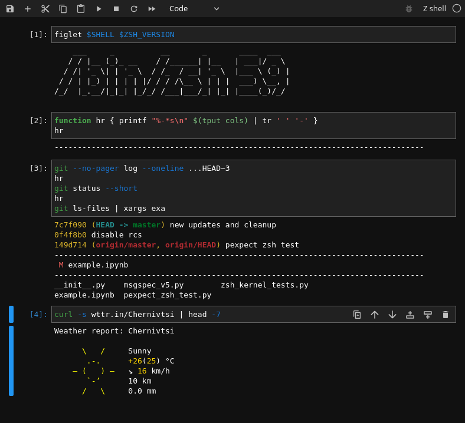

# zsh kernel for jupyter



a simple z shell jupyter kernel powered by python 3, pexpect and enthusiasm.

i love experimentation and tinkering, but usual shell terminals do not allow developing multiple different code snippets at once conveniently.
with shell kernels you can turn your scripts into notebooks!

if you find this product useful, please consider supporting me with a one-time tip.

feedback and suggestions are welcome in [github issues](https://github.com/dan-oak/zsh-jupyter-kernel/issues).

## installation

install the python package from [pypi](https://pypi.org/project/zsh-jupyter-kernel/) using available package manager like `pip` or `pipenv`

(optional) by default the installation script will install the package *and* the kernel. the kernel location will be the same as the python environment from which the installation is done. check `python -m zsh_jupyter_kernel.install -h` for possible installation options if you want to install the kernel in a different environment or to change display name.

### pipenv

```sh
pipenv --python 3.10 install notebook zsh_jupyter_kernel
```

### pip

```sh
python -m pip install notebook zsh_jupyter_kernel
```

## usage

expect the kernel to work as usual including your zsh configs *except without stdin (user input) support and prompt line* and in the boundaries of the current jupyter limitations like not all ansi codes will work in certain cases ('\r') and in general things that expect terminal will have unexpected behavior.
see below why user input is not supported.

## technical overview

the kernel launches zsh as if it was a regular process launched from your terminal with a few minor settings to make sure it works with jupyter. there is slight chance it wont work with super complicated zshrc setups, but it works with majority of configs including oh-my-zsh.

### how does code execution work

the kernel configures zsh prompt string to its own custom value.
when a user requests a cell execution, the code is sent to the kernel.
then the kernel puts the frontend on hold, sends the code to zsh process, and waits for the prompt string to release the frontend and let the user request more code execution.

### code completion

code completion is powered by quite a non-trivial script that involves multiple steps, including spawning another temporary zsh process and capturing completion options into a data structure that jupyter frontend understands.

### code inspection

code inspection is done by `man --pager ul` which sends the whole man page to the frontend.

### code completeness

code completeness is checked with the temporary zsh process and help of `EXEC` zsh option, which allows switching off code execution and simply check if the code is complete using the exit code of the zsh process itself.

### stderr

stderr content is just sent to the front-end as regular stdout the same way it is in a terminal.

### stdin

stdin is not supported because of the execution system when a process spawned by a user waits for stdin, there is no way to detect it.

jupyter is a request-reply system, and zsh as a shell that constantly receives input and prints whatever current processes want to output. there is no clear start and end of a code execution in a shell unlike in jupyter system: a front-end sends a code from a cell to a kernel and waits until the kernel sends the full output back.

because of these two different ways of interacting with user zsh jupyter kernel cannot process stdin in a way python kernel does on `input()`, meaning you will not be able to enter a sudo password or answer y/n to prompts or use a pager like less. when a spawned program waits for a user input, you will need to interrupt the kernel and use any options which do not require input.

## troubleshooting

please let me know if you encounter an error or unexpected behavior using [github issues](https://github.com/dan-oak/zsh-jupyter-kernel/issues).
i will respond as soon as possible.
